<p align="center">
  
</p>

# Rebyt — Intent Payments Verified by ZK Proofs and AI Consensus

> Typed intent flows with programmable wallet execution, secured by zero-knowledge proofs and validated by AI consensus on GenLayer.

## The Problem

Crypto payments execute first and verify later — or never.

Rebyt changes that: every payment is backed by a zero-knowledge proof of intent correctness and validated by AI consensus before funds are released. Execution is no longer trusted — it is proven.

## The Solution

Rebyt introduces a validation layer between intent and execution.
Users sign what they want. AI validators evaluate delivery conditions.
Escrow settles automatically. No single component can cheat.

<p align="center">
  
</p>

## Architecture

### Layer 1 — Intent (EIP-712)
User signs a `PaymentIntent` using EIP-712 typed data via a session wallet. No direct transaction required. No MetaMask needed.

### Layer 2 — ZK Proof (Circom + Groth16)
Before the escrow accepts funds, the Solver generates a zero-knowledge proof that the intent data matches the hash:

```
Poseidon(recipient, amount, nonce) == intentHash
```

The `Groth16Verifier` contract validates this proof onchain.
The Solver cannot lie about what it is paying for.

### Layer 3 — Escrow (Solidity + BSC Testnet)
`RebytEscrow.sol` locks funds linked to the `intentHash`.
`fundWithZK()` requires a valid ZK proof before accepting deposit.
State machine: `PENDING → FUNDED → VALIDATING → RELEASED | REFUNDED`

### Layer 4 — AI Validation (GenLayer Bradbury)
`DeliveryValidator.py` is an Intelligent Contract deployed on GenLayer Bradbury testnet. It uses:
- **Optimistic Democracy** consensus (5 validators, each running their own LLM)
- **Equivalence Principle**: "Two outputs are equivalent if they both agree on whether delivery conditions were met"

### Layer 5 — Settlement (rebyt-relayer.mjs)
The relayer reads the GenLayer result and calls `escrow.release()` or `escrow.refund()` on BSC Testnet.
Every step is verifiable on BscScan and GenLayer Studio.

## Tech Stack

| Layer | Technology |
|---|---|
| Intent signing | EIP-712 (viem) |
| Session wallet | EIP-7702 — upgrade path (BNB Chain Pascal) |
| ZK circuit | Circom 2.2.3 + snarkjs |
| Proof system | Groth16 / BN128 |
| Smart contracts | Solidity ^0.8.20 + Foundry |
| AI validation | GenLayer Python SDK (Intelligent Contract) |
| Relayer bridge | Node.js ESM |
| Frontend | React + Vite + Tailwind |
| Settlement chain | BSC Testnet (Chain ID: 97) |
| Validation chain | GenLayer Bradbury testnet |

## Contract Addresses (BSC Testnet)

| Contract | Address |
|---|---|
| RebytEscrow (ZK enabled) | `0x5191Bca416e2De8dD7915bdD55bf625143ABB98C` |
| Groth16Verifier | `0x5cBC63B27AF1427096C644DdC66B56cf01006A1e` |

## Contract Addresses (GenLayer Bradbury)

| Contract | Address |
|---|---|
| DeliveryValidator.py | `0xc84ef0aEC4A8b4e5241231296C4a201cb56380C6` |

## Key Transactions

**ZKProofVerified event** (`fundWithZK`):
https://testnet.bscscan.com/tx/0x1bce644f6ac296bbd5a75ffa0b783987d8648355bb4dd912d6cbe8970995ab3e

**Settlement confirmed** (`release`):
https://testnet.bscscan.com/tx/0x98f5ae6cc8ba95e139d5b5c4ce54822c7c4074f0ff75bacb7774d7645cfec453

## Bradbury Bug Report

During integration we documented 6 reproducible issues with GenLayer Bradbury `gen_call` reliability. Full report: [BRADBURY-BUG-REPORT.md](BRADBURY-BUG-REPORT.md)

Submitted as contribution to the Bradbury Special Track.

## Demo Video

[fill Sunday morning]

## Tracks

- **GenLayer**: Intelligent Contract with Optimistic Democracy + Equivalence Principle on Bradbury
- **Bradbury Special Track**: 6 reproducible bug reports with proposed SDK improvements
- **PL Genesis**: best overall project
- **BNB Chain**: BSC Testnet deployment, EIP-7702 upgrade path on BNB Pascal

## Hackathon

Aleph Hackathon Buenos Aires — March 20–22, 2026